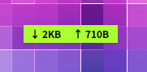
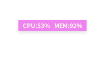
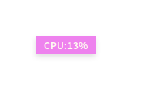
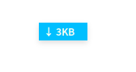
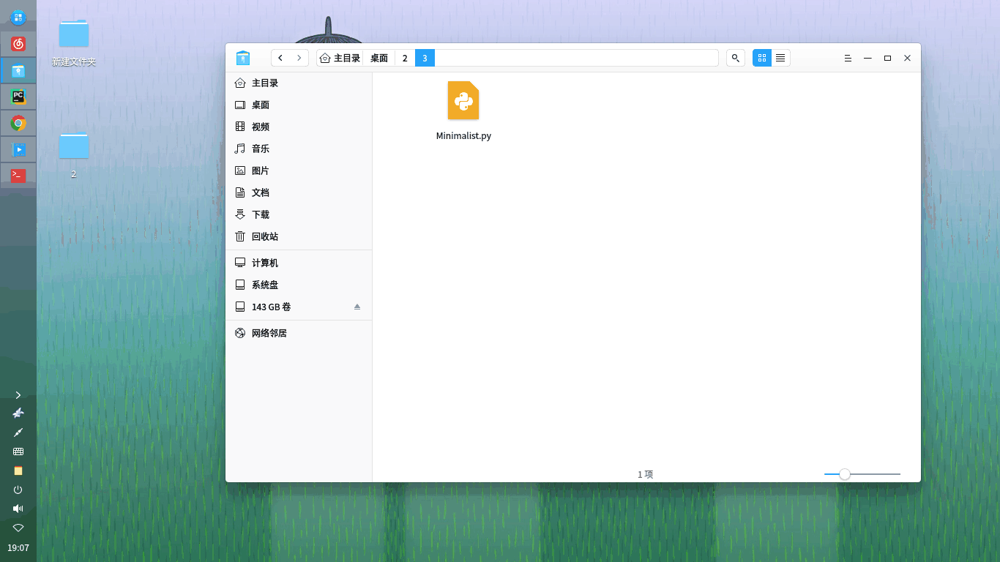

# Minimalist
极简系统监视器

我之前写的第一个python工具，没学多久，所以代码写得不是很好，没有封装。

注意：只能在linux上运行，需要安装python3的tkinter模块。

软件操作说明：
左键双击窗口换肤，右键双击退出程序；
右键单击窗口左侧切换显示流量还是CPU和内存占用；
右键单击窗口右侧切换显示全部或一部分内容。
悬浮窗口移动到屏幕右边时会自动隐藏，当鼠标再次移动到悬浮窗口上时，悬浮窗口会弹出。

